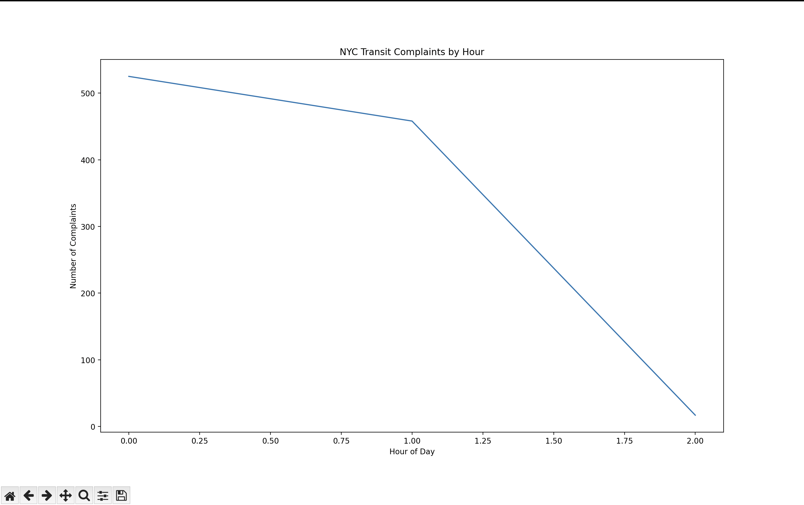

# NYC Data Analysis Project 🚇

## About the Project
This project analyzes real-world NYC data using Python.  
I built it to practice data analysis, visualization, and API usage while creating a project that can be shown to recruiters.

The project pulls data from NYC public datasets, cleans and processes it, and produces visual insights like charts and trends.  

## Features
- Fetches real NYC data using APIs (`requests`)
- Cleans and organizes data with `pandas`
- Visualizes data trends using `matplotlib`
- Shows peak activity or complaint hours for NYC services (example: transit complaints)

## Tech Stack
- Python
- pandas
- matplotlib
- requests

## Screenshots

### Example Plot 1
This chart shows NYC complaints by borough:



## How to Run
1. Clone the repository:
```bash
git clone https://github.com/mdhoque125/nyc-data-project.git

2. Install dependencies:
pip install -r requirements.txt
3. Run the Project:
python main.py
4. Check generated plots or outputs.

Why I Built This

I wanted a practical Python project to demonstrate:
Data handling and cleaning
Visualization skills
Working with APIs
Real-world problem-solving relevant to NYC

Author
Md Mizanul Hoque
NYC Based | CIS Major + CS Minor | Information Assistant, System Analyst and IT Support Experience
